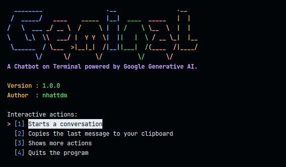

# Geminal

A Chatbot on Terminal powered by Google Generative AI.

## Demo



## Tested on

- Ubuntu 22.04
- Python 3.10

## Notes

- If you don't have your own GOOGLE API KEY, visit [Makersuite by Google](https://makersuite.google.com/) and create a new one for free.
- Use `Tab` for a newline (multiline input).
- The list of actions that interact with the last response from Gemini will not be available if you run the application in a container.

## How to install it

- **Step 1:** Install the xclip package.

```bash
sudo apt update
sudo apt install xclip # dependency for pyperclip library in Python.
```

- **Step 2:** Set the GOOGLE_API_KEY as an environment variable.

```bash
echo 'export GOOGLE_API_KEY={YOUR_GOOLE_API_KEY}' >> ~/.bashrc
```

- **Step 3:** Install Geminal.

```bash
git clone https://github.com/nhattdm/geminal.git
cd geminal
pip install .
```

- **Step 4:** Start Geminal.

```bash
geminal
```

or

```bash
geminal "{YOUR_PROMPT}"
```

## Running with Docker

- **Step 1:** Build the image with the `GOOGLE_API_KEY`.

```bash
docker build --build-arg GOOGLE_API_KEY=$(echo $GOOGLE_API_KEY) -t geminal .
```

- **Step 2:** Set an alias for running `geminal` in the container.

```bash
echo "alias geminal='docker run -it --rm --name geminal geminal'" >> ~/.bashrc
```

- **Step 3:** Start Geminal.

```bash
geminal
```

## Contributing

I don't have plans to continue maintaining this project anymore. Feel free to contribute to this project if you have any further ideas.
