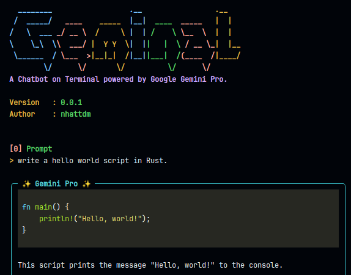

# Geminal

A Chatbot on Terminal powered by Google Generative AI.

## Demo



## Tested on

- Ubuntu 22.04
- Python 3.10

## How to install it

- __Step 1:__ Install the xclip package.

```bash
sudo apt update
sudo apt install xclip # dependency for pyperclip library in Python.
```

- __Step 2:__ Set the GOOGLE_API_KEY as an environment variable.

> __Note:__ If you don't have your own GOOGLE API KEY, visit [Makersuite by Google](https://makersuite.google.com/) and create a new one for free.

```bash
echo 'export GOOGLE_API_KEY={YOUR_GOOLE_API_KEY}' >> ~/.bashrc
```

- __Step 3:__ Install Geminal.

```bash
git clone https://github.com/nhattdm/geminal.git
cd geminal
pip install .
```

- __Step 4:__ Start Geminal.

```bash
geminal
```

or

```bash
geminal "{YOUR_PROMPT}"
```

## Running with Docker

- __Step 1:__ Build the image with the `GOOGLE_API_KEY`.

```bash
docker build --build-arg GOOGLE_API_KEY=$(echo $GOOGLE_API_KEY) -t geminal .
```

- __Step 2:__ Set an alias for running `geminal` in the container.

```bash
echo "alias geminal='docker run -it --rm --name geminal geminal'" >> ~/.bashrc
```

- __Step 3:__ Start Geminal.

```bash
geminal
```

## Available commands

| Command         | Description                                                 |
| --------------- | ----------------------------------------------------------- |
| /help, /h       | Shows the list of acceptable commands.                      |
| /new, /n        | Removes the conversation history and starts a new one.      |
| /save, /s       | Saves the current conversation.                             |
| /load, /l       | Loads a saved conversation.                                 |
| /delete, /d     | Deletes a saved conversation.                               |
| /copy, /c       | Copies the last message to your clipboard.                  |
| /copy_code, /cc | Copies a code from the last message to your clipboard.      |
| /quit, /q       | Quits the program.                                          |

> __Note:__ Use `Alt + Enter` for a newline (multiline input).

## Contributing

Feel free to contribute to this project if you have any further ideas.
